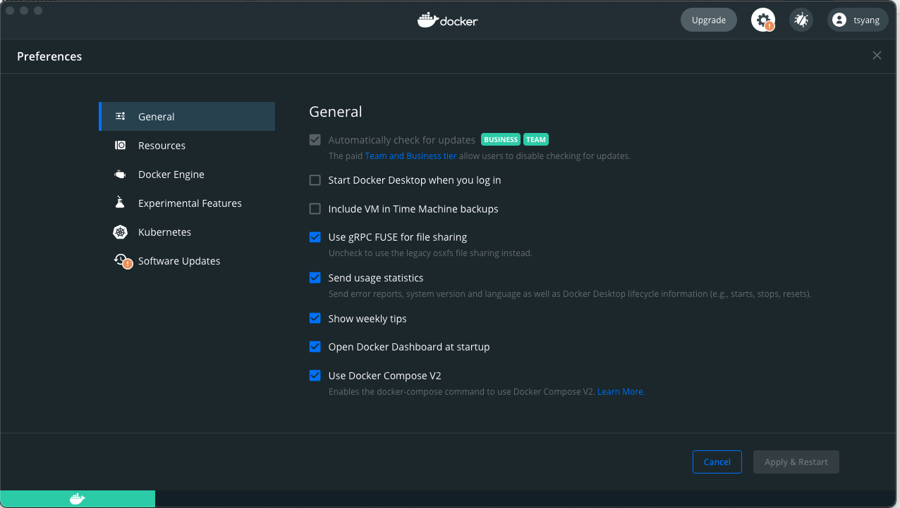

# CMPE273_proj

## Prerequisites

- We are using [Postman](https://www.postman.com/downloads/) as client.
- We need [Docker](https://www.docker.com/products/docker-desktop) to run the server and DB.  

    Check docker version

    ```shell
    docker --version
    ```

    Create Docker Network so that our container can communicate with each other

    ```shell
    sudo docker network create --attachable -d bridge techbankNet
    sudo docker network ls
    ```

    `--attachable`: allow us to manually attach out container to this network  
    `-d bridge`: specify the network driver as bridge
    `ls`: list all the network

- Run docker compose:

    Compose is a tool for defining and running multi-container Docker applications. We use Docker Compose to run `Kafka` and `Apache Zookeeper` in Docker as container

    Install or init [Docker Compose](https://docs.docker.com/compose/install)

    Here I cam using docker desktop on Mac, by clicking `Use Docker Compose V2` we can use `docker-compose command directly in our terminal.

    ```shell
    docker-compose up -d
    ```  

    `-d`: run as detached

- Run MongoDB  

    Download Client Tools – [Studio 3T Free](https://studio3t.com/download/): 

    Run in Docker:

    ```shell
    sudo docker run -it -d --name mongo-container \
    -p 27017:27017 --network techbankNet \
    --restart always \
    -v mongodb_data_container:/data/db \
    mongo:latest
    ```

- MySQL

    Run in Docker:

    ```shell
    docker run -it -d --name mysql-container \
    -p 3306:3306 --network techbankNet \
    -e MYSQL_ROOT_PASSWORD=techbankRootPsw \
    --restart always \
    -v mysql_data_container:/var/lib/mysql  \
    mysql:latest
    ```

    Client tools in Docker – Adminer:

    ```shell
    docker run -it -d --name adminer \
    -p 8080:8080 --network techbankNet \
    -e ADMINER_DEFAULT_SERVER=mysql-container \
    --restart always adminer:latest
    ```

    Open the browser and go to [127.0.0.1:8080](http://127.0.0.1:8080/) 

## CQRS & Event Sourcing with Kafka

- Messages:
  - Commands: combination of expressed intent
  - Events: describe something that has occurred in the application. e.g. account opened, funds deposited
  - Queries:
- Aggregate: entity or group of entities that is always kept in a consistent state.
- Event Store: database that stores a sequence of events over time.
  - **append only**.
  - events should represent the version or state of an aggregate.
  - events are stored in chronological order.
  - the state of aggregate can be recreated by replaying the event store
  - optimistic concurrency control

## Kafka


- Producer: send or produce messages to Kafka topics
- Consumer: consume message from the topic subscribed
- Broker:
  - server running in a cluster(in a form of container).
  - it can handle thousands of messages without a performance impact.
  - Partition: Topics are divided into partitions in the cluster. The partitions are replicated across brokers.
  - Topic: a channel(queue) which event data is streamed.
- Apache Zookeeper: manage the state of the cluster(broker). e.g. election of the broker leader.
